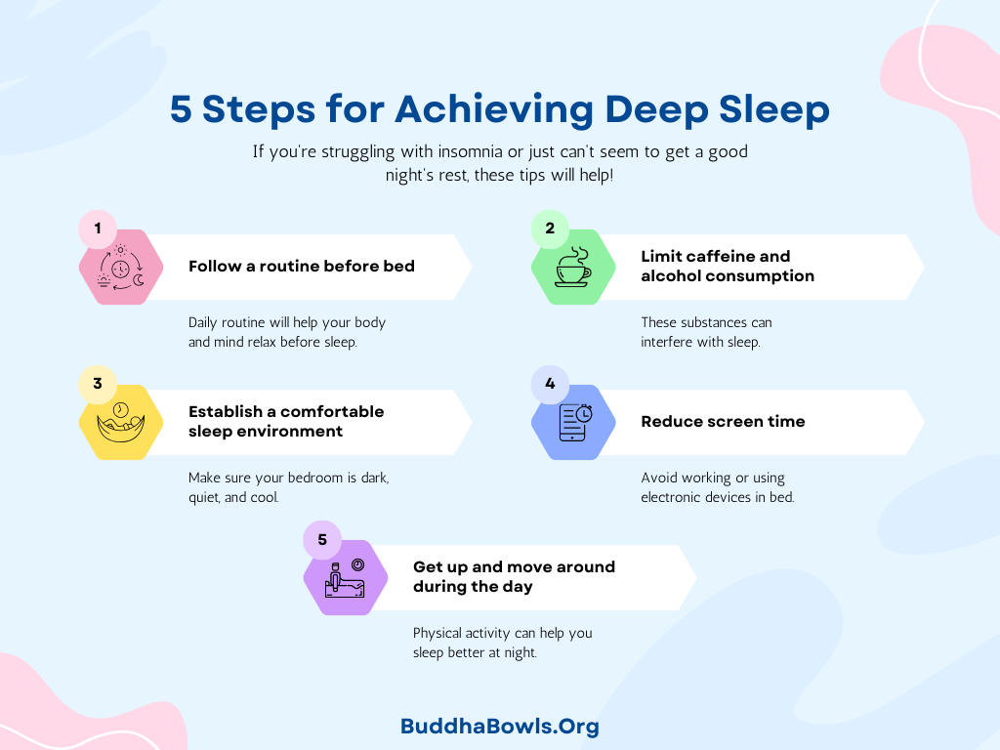

**Achieving Deep Sleep: A Comedic Guide to Snoozeland**

Ah, deep sleep. That elusive, dreamy state where your body regenerates, your brain files away memories, and you blissfully escape the chaos of the waking world. But let’s face it—achieving deep sleep can sometimes feel as impossible as finding matching socks in the laundry. Fear not, my sleep-deprived friend! I’m here to guide you to the land of REM with humor, wit, and a touch of absurdity.

### Step 1: The Bedtime Ritual (AKA “The Sleep Olympics”)

First things first: you need a solid bedtime routine. This is the part where you pretend you’re a medieval knight preparing for battle—except instead of armor, you’re donning fuzzy slippers and a questionable face mask.

- **Dim the lights**: Create a cozy cave-like atmosphere. If your neighbors think you’ve joined a bat colony, you’re doing it right.

- **Brush your teeth**: Nothing says “I’m ready for bed” like aggressively scrubbing your molars while trying not to drip toothpaste on your pajamas.

- **Put down your phone**: Yes, I know TikTok is calling your name, but trust me, no one needs to watch another slow-motion video of someone making lasagna at 2 a.m.

Pro tip: If you absolutely must scroll, set your phone’s brightness to “cave-dwelling mole” mode and wear sunglasses. Fashionable? No. Effective? Also no. But hey, you’ll look mysterious.

### Step 2: The Mattress Dilemma

Your mattress is the throne of your sleep kingdom. If it’s old, lumpy, or feels like it was stuffed with rocks (or regrets), it’s time to upgrade. But beware—shopping for a mattress is like dating. You’ll bounce around from one option to another, testing them out awkwardly in public until you find “The One.”

Memory foam? Spring coils? Hybrid? Honestly, mattresses have more personality types than people on dating apps. Just pick one that doesn’t make you feel like you’re sleeping on a medieval torture device.

### Step 3: Pajamas: The Unsung Heroes

Let’s talk sleepwear. Are you Team Matching Pajamas, or do you rock that “random old T-shirt with holes in it” look? Either way, comfort is key. If your pajamas pinch, itch, or make you feel like you’re wrapped in sandpaper, your dreams of deep sleep will be crushed faster than a bag of chips at a party.

Bonus points if your pajamas come with pockets. Why? Who knows. But it feels powerful.

### Step 4: The Temperature Tango

Finding the perfect sleeping temperature is an art form. Too hot? You’ll wake up feeling like a rotisserie chicken. Too cold? You’ll be shivering under six blankets like a burrito with trust issues.

Experts suggest keeping your room cool—around 65°F (18°C). If you’re sharing the bed, this might lead to thermostat wars with your partner. Just remember: love is about compromise… unless they hog the covers. Then all bets are off.

### Step 5: The Great Pillow Debate

Ah, pillows—the unsung heroes of sleep. Some people like them flat as pancakes; others want them so fluffy they could double as life rafts. And then there’s that one person who sleeps with *eight pillows* arranged in a fortress around them like they’re protecting the crown jewels.

Find a pillow that supports your head and neck without making you feel like you’re sleeping on a marshmallow—or worse, a brick. Bonus tip: If your pillow is older than your Netflix subscription, it’s probably time for an upgrade.

### Step 6: The Midnight Snack Dilemma

Picture this: You’re lying in bed, trying to drift off, when suddenly… hunger strikes! Do you get up and raid the fridge? Or do you heroically ignore your growling stomach?

The answer is neither. Instead, have a light snack *before* bed—something boring but effective, like a banana or a handful of almonds. Avoid spicy foods unless you enjoy dreaming about dragons breathing fire in your stomach.

### Step 7: Counting Sheep (or Something Weirder)

When all else fails and sleep refuses to come, there’s always the classic method: counting sheep. But let’s be real—who actually does this? Instead, try counting something more fun, like tacos or puppies wearing tiny hats. Or make up a ridiculous story in your head until you bore yourself to sleep.

For example: Imagine you’re a detective solving the mystery of why socks disappear in the dryer. Spoiler alert—it’s aliens.

### Step 8: Embrace the Weird Sleep Aids

If traditional methods aren’t cutting it, there’s no shame in getting creative. White noise machines? Sure! Lavender-scented pillow sprays? Why not! A weighted blanket that feels like a hug from a giant bear? Absolutely!

Just don’t go overboard and end up with so many gadgets that your bedroom looks like a science experiment gone wrong.

### Final Thoughts

Achieving deep sleep doesn’t have to be a stressful quest—it can be as simple (and hilarious) as finding what works for you. Whether it’s perfecting your bedtime routine or investing in comfy pajamas that make you feel like royalty, remember that sleep is supposed to be relaxing—not another item on your to-do list.

So go forth, my sleepy comrade! Conquer the night with laughter and determination. And if all else fails… well, there’s always coffee in the morning. Sweet dreams!

  

